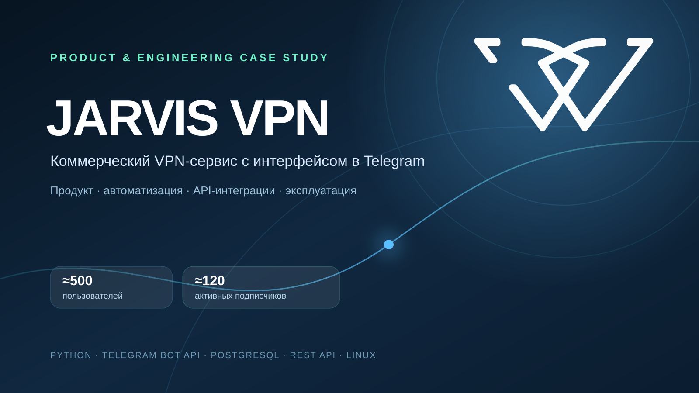
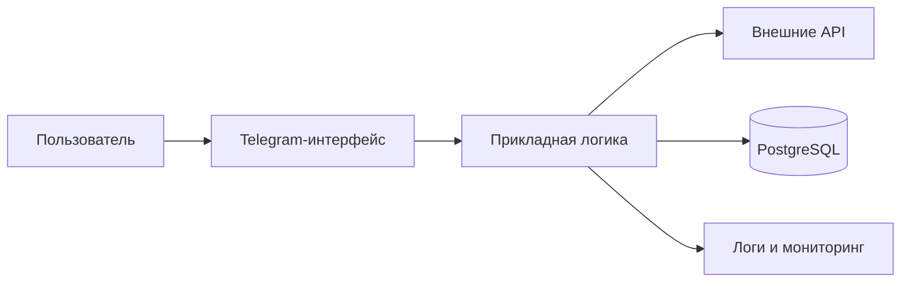

# JARVIS VPN

Коммерческий VPN-сервис с основным пользовательским интерфейсом в Telegram.

> Этот репозиторий задуман как публичный продуктовый и инженерный кейс. Коммерческий исходный код, секреты, конфигурации серверов и пользовательские данные в него не входят.

## О продукте

JARVIS VPN позволяет пользователю взаимодействовать с сервисом через привычный интерфейс Telegram. Для подключения можно использовать HAPP, Incy, v2rayTun и другие клиентские приложения, поддерживающие совместимый формат конфигурации. Работа над продуктом включает проектирование пользовательских сценариев, интеграцию внешних API, хранение состояния и данных, выпуск обновлений и контроль сервиса после релиза.

Публичные точки входа:

- [сайт JARVIS VPN](https://jarvis-vpn.com);
- [Telegram-бот](https://t.me/jarv1svpnbot).

## Публичный продуктовый контур

По информации на действующем сайте продукта пользователю доступны:

- пробный период на 3 дня;
- подключение через HAPP, Incy, v2rayTun и другие совместимые клиентские приложения;
- 5 устройств в базовой подписке с возможностью расширения до 45;
- локации в 8 странах и отдельные маршруты для обхода ограничений;
- помощь с установкой и реферальный сценарий.

В кейсе перечислены только функции, уже описанные на публичном сайте. Внутренние правила тарификации, параметры серверов и техническая реализация не раскрываются.

## Моя роль

Я работаю над JARVIS VPN как ведущий разработчик и самостоятельно закрываю большую часть цикла поставки функций:

1. определяю пользовательскую или бизнес-задачу и ожидаемый результат;
2. изучаю текущую логику, зависимости, движение данных и возможные точки отказа;
3. декомпозирую реализацию, в том числе с помощью Codex;
4. дорабатываю Python-код, Telegram-сценарии, API-интеграции, webhooks и работу с PostgreSQL;
5. проверяю основной путь, некорректный ввод, повторные действия, ошибки внешних сервисов и пограничные состояния;
6. выполняю ручную или полуавтоматическую выкладку на Linux-сервер;
7. после релиза контролирую логи, ключевые команды, обращения пользователей и продуктовые показатели.

## Высокоуровневая архитектура

Схема намеренно не содержит адресов серверов, сетевой топологии, названий поставщиков, ключей и внутренних точек доступа.

## Инженерные задачи

- проектирование диалоговых и сервисных сценариев в Telegram;
- управление краткоживущим состоянием через FSM;
- хранение долгоживущих данных и результатов операций в PostgreSQL;
- интеграции через REST API и webhooks;
- валидация входных данных и ответов внешних сервисов;
- обработка исключений, тайм-аутов и ошибочных состояний;
- журналирование технического контекста без раскрытия его пользователю;
- защита критических операций от ложного успешного завершения;
- ручная проверка сервиса после выпуска обновлений.

## Работа с AI-инструментами

ChatGPT и Codex используются как часть AI-assisted процесса разработки:

- уточнение требований и декомпозиция задач;
- анализ существующей кодовой базы;
- подготовка вариантов реализации;
- поиск причин ошибок по коду и логам;
- составление тестовых сценариев;
- подготовка документации.

Результат AI не принимается автоматически: изменения проверяются в контексте проекта, корректируются и проходят функциональную проверку перед выпуском.

## Результаты

По состоянию на сентябрь 2026 года:

- около 500 пользователей воспользовались сервисом за всё время;
- около 120 пользователей имели активную платную подписку;
- продукт работал как коммерческий сервис, а не как учебный прототип.

Метрики округлены и не сопровождаются выгрузкой пользовательских данных.

## Что можно показать публично

После обезличивания в кейс можно добавить:

- стартовый экран и главное меню Telegram-бота;
- один законченный пользовательский сценарий без идентификаторов и кодов доступа;
- публичные страницы сайта;
- агрегированный экран метрик без строк пользователей;
- схему процесса разработки и выпуска функции;
- короткий скринкаст с тестовым аккаунтом и синтетическими данными.

## Конфиденциальность

В публичный кейс не входят:

- коммерческий исходный код;
- `.env`, токены, пароли, API-ключи и приватные ключи;
- VPN-конфигурации, сертификаты и параметры подключения;
- IP-адреса, домены внутренних сервисов и сетевые схемы;
- дампы базы данных, SQL-выгрузки и резервные копии;
- Telegram ID, телефоны, имена, переписка и платёжные данные пользователей;
- необезличенные логи;
- внутренние цены, договоры и сведения о поставщиках, если они не предназначены для публикации.

## Ограничения публичного кейса

Это демонстрация продуктовой и инженерной работы, а не репозиторий с запускаемым исходным кодом. Детали реализации, которые могут раскрыть коммерческую логику или снизить безопасность сервиса, намеренно опущены.
